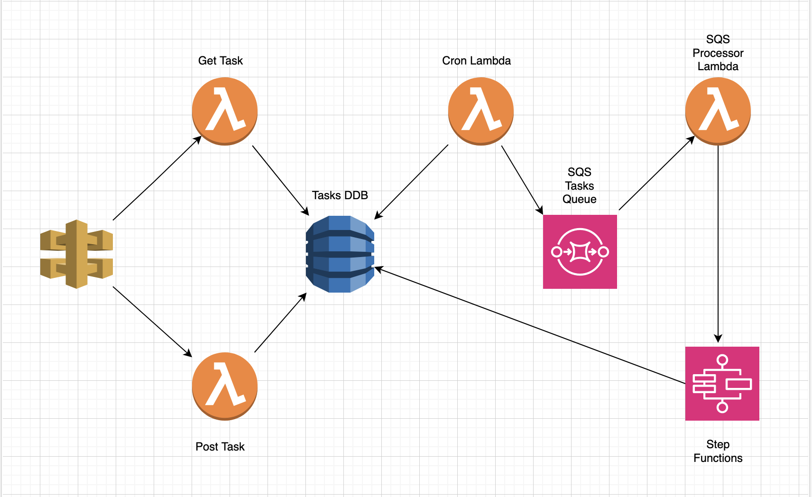
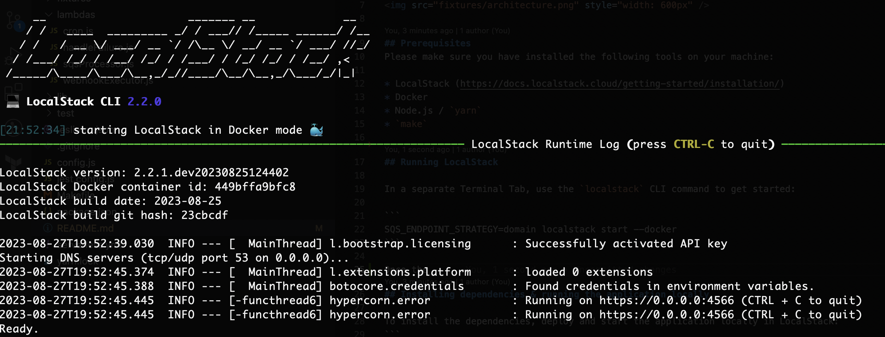
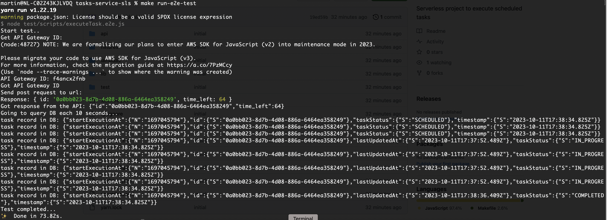

# Tasks Service

Note: this is playground service used to get up to speed with LocalStack (https://docs.localstack.cloud/getting-started)

The idea for functionality service provides came from the following blog posts:
- https://theburningmonk.com/2019/05/using-cloudwatch-and-lambda-to-implement-ad-hoc-scheduling/
- https://theburningmonk.com/2019/03/dynamodb-ttl-as-an-ad-hoc-scheduling-mechanism/
and the following project: 
- https://github.com/localstack/localstack-demo

The Tasks Service is a comprehensive solution that combines ExpressJS-based APIs with AWS services like API Gateway, Lambda Functions, DynamoDB, SQS, and State Machine. Together, these components create a versatile and scalable platform for processing tasks efficiently.

The figure below outlines the application architecture with the different components and services involved in processing the tasks.



The graph of the AWS SFN State Machine looks like this:


### How does it work
The idea is to leverage the functionality of AWS State Machines (the Wait step, in particular) in order to execute tasks with second level precision. To achieve this, the service starts the processing of each task up to ~2 minutes before the scheduled execution time.
The backend stores the scheduled tasks in a DynamoDB table (please see DB Schema). The `cron` Lambda function runs each minute, and queries the DB for tasks that are scheduled in less than 2 minutes and offloads them to a SQS Queue. From there, the queue is drained by the `processSQSRecords` lambda which starts `State Machine workflow` for each task.

### DB Schema
The DB Table holds the following details:
* id (the partition key of the table) 
* timestamp (the timestamp when the webook should be executed)
* startExecutionAt (a timestamp that is 2 minutes before the original timestamp, this is used by the `cron` to trigger execution ~2 minutes in advance)
* taskStatus (one of `SCHEDULED|IN_PROGRESS|COMPLETED|FAILED`)
* lastUpdatedAt (the timestamp when the task was last updated by the backend components)

* the GSI of the table is composite key (taskStatus (pk), startExecutionAt(sk))
Here is a sample item from DynamoDB tasksTable: 
```
{"startExecutionAt":{"N":"1693159759"},"id":{"S":"fd3f604f-a59d-4ffb-a9ac-bea70429084a"},"taskStatus":{"S":"COMPLETED"},"lastUpdatedAt":{"S":"2023-08-27T18:11:22.848Z"},"timestamp":{"S":"2023-08-27T18:11:19.700Z"}}
```

## Prerequisites
Please make sure you have installed the following tools on your machine:

* LocalStack (https://docs.localstack.cloud/getting-started/installation/)
* Docker
* Node.js / `yarn`
* `make`

## Running LocalStack on your machine

In a separate Terminal Tab, use the `localstack` CLI command to get started:

```
SQS_ENDPOINT_STRATEGY=domain localstack start --docker
```
Note: If `SQS_ENDPOINT_STRATEGY=domain` is not passed as env var in the command, the SQS Queue might not be reachable from other Lambda containers, please find more details here: (https://docs.localstack.cloud/user-guide/aws/sqs/#accessing-queues-from-lambdas-or-other-containers)

Once LocalStack is started successfully, you will see the following output in your terminal: 

* Please make sure docker is running on your machine, before starting LocalStack



## Installing dependencies & running the application locally on macOS

Once you have LocalStack running, you can install the dependencies, deploy and start the application locally with the command:
```
make deploy-local
```

Note: this command will deploy the Serverless app (the CloudFormation stack) with LocalStack on your machine. 
The output of the command gives the URL of the deployed API Gateway REST API. 


You can use this URL to manually query the API endpoints with tools like `curl` or `Postman`. 
Additionally, if you need to query other backend components like CloudWatch, DynamoDB, SQS, etc. You will need to have `aws cli` installed in your terminal. Once installed, you need to set up an `aws profile` with dymmy credentials (see: https://docs.localstack.cloud/references/credentials/#alphanumeric-string).

In the following example command, I am using the aws cli with `--profile` flag (with dummy credentials), to query `tasksTable-local` Dynamo DB table for a task item ID: `56e81feb-55e3-44e6-b13f-24be2968b4c9`: 

```
aws --endpoint-url=http://localhost:4566  dynamodb get-item --table-name tasksTable-local --key '{"id": {"S": "56e81feb-55e3-44e6-b13f-24be2968b4c9"}}' --profile martin-local
```

## E2E, Unit Tests and Lint
To run the E2E tests:
```
make run-e2e-test
```

Note: The E2E test script currenty does the following: 
1) Creates a task through the POST `/tasks` API endpoint. The input data in the test in static, and always schedules a task in 65 seconds from the start of the script. 
2) Then the test queries the DB and outputs the DB record of the created task in the console. In this way, the updates on the task status can be observed. The task status will go through the phases `SCHEDULED->IN_PROGRESS->COMPLETED|FAILED` as the task is being processed by the backend services (Lambda functions, Step Functions state machine).
3) Test ends either when task status is updated to `COMPLETED|FAILED` or after hardcoded timeout of 3 minutes.



To lint the code, run the following command
```
yarn lint
```

To run unit tests, run the following command
```
yarn test
```

## Deploying the service to AWS Account
To deploy the service in an actual AWS Account, configure your AWS_PROFILE and pass it to the following command as an env var
```
make -e AWS_PROFILE=<your-aws-profile> make deploy-dev
```


